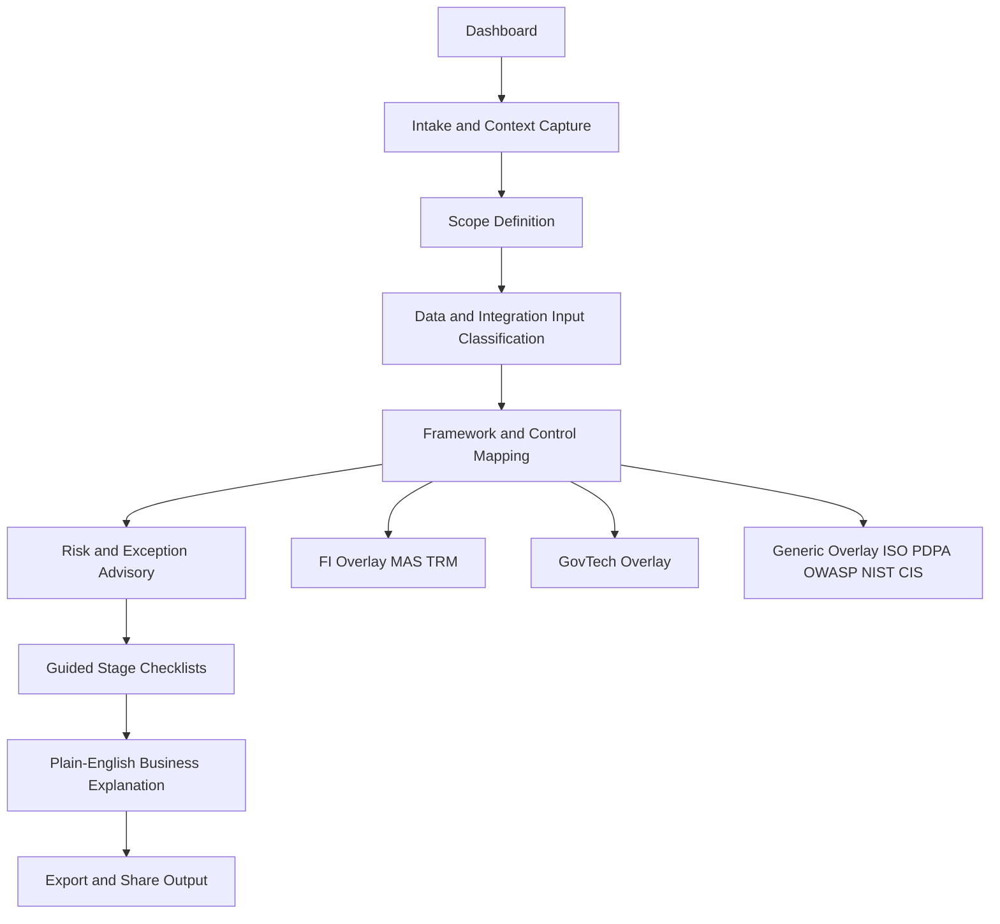

# High-Level Architecture Flow and Disclaimer

## High-Level Architecture Flow

## Information Usage Disclaimer

This tool is a decision-support and consistency aid. It does not replace formal legal, regulatory, audit, or certification advice.

1. Guidance is advisory and should be validated against official and current framework sources.
2. Internal architecture notes, risk assessments, and control mappings are sensitive operational information even when no personal data is stored.
3. Outputs should be reviewed by the relevant security architect, compliance owner, or risk approver before external sharing.
4. Framework references may evolve over time; users must verify version applicability before final decisions.
5. Risk acceptance decisions must follow organizational governance and approval authority.

## Risks and Pointers When Accessing This Information

### A. Integrity Risks

- Outdated framework interpretation can result in wrong decisions.
- Unauthorized edits can alter risk severity or control mapping outcomes.
- Missing traceability from requirement to control to evidence can weaken audit defensibility.

Pointers:
- Keep version history for edits and approvals.
- Record timestamps and ownership for changes.
- Preserve source references for key control decisions.

### B. Confidentiality Risks

- Engagement notes can expose architecture details, control weaknesses, and business priorities.
- Exported files can be shared beyond intended recipients.
- Offline PWA cache may retain sensitive internal advisory content.

Pointers:
- Classify all content as Internal Advisory unless explicitly approved otherwise.
- Add visible classification labels to screens and exports.
- Restrict access in shared devices and review cache policy.

### C. Availability Risks

- Tool outage during RFQ/RFP and audit windows reduces response readiness.
- Dependency or build issues can block access to guidance.

Pointers:
- Maintain local/offline baseline for critical pages.
- Keep dependency updates controlled and tested.
- Maintain backup exports of key templates.

### D. Application Security Risks

- XSS risk if user-entered or markdown content is rendered unsafely.
- Prompt injection risk once AI/Q&A is enabled.
- Supply-chain risk from vulnerable npm dependencies.

Pointers:
- Enforce schema validation for all persisted objects.
- Apply strict Content Security Policy and safe rendering patterns.
- Run dependency scanning in CI and patch high-severity findings promptly.

### E. Governance and Decision Risks

- Users may treat generated guidance as final policy.
- Risk exceptions without expiry/review date can become permanent blind spots.

Pointers:
- Mark recommendations as advisory.
- Require owner, approver, rationale, and review date for exceptions.
- Differentiate blockers vs managed residual risks at go-live.

## Minimum Control Baseline for This Tool

- Content classification banner on every page and export.
- Role mode separation at minimum: Viewer and Editor.
- Immutable metadata for records: createdAt, updatedAt, owner.
- Input schema validation using zod.
- CI checks for build, lint, and dependency audit.
- Optional access gate for internal environments.
