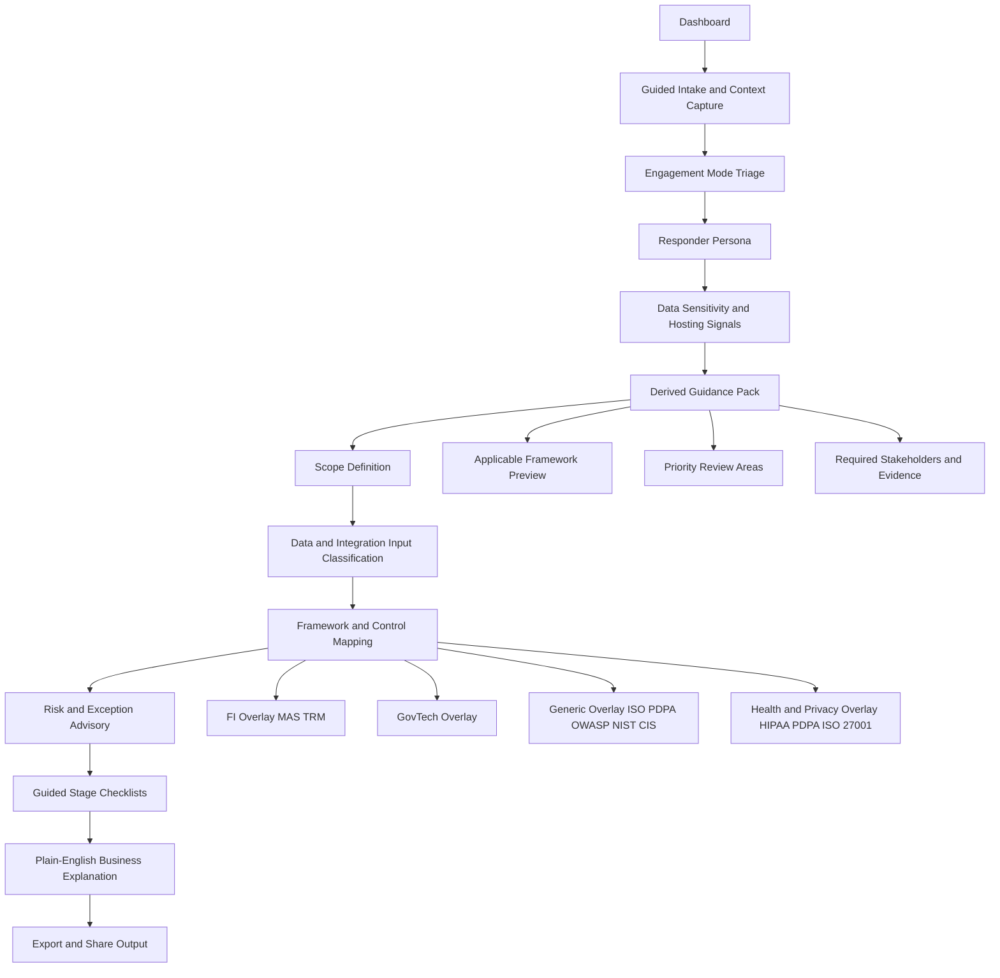

# High-Level Architecture Flow and Disclaimer

## Document Control

- Version: 1.2
- Last Updated: 2026-04-06
- Status: Draft
- Owner: Security Architect Refresher project
- Change Summary: Added guidance for the implemented baseline history and intake-driven prefill workflow alongside the earlier intake triage design.

## High-Level Architecture Flow

## Guided Intake Design

The intake stage should become a triage and routing step rather than a full compliance questionnaire. It should collect only the minimum information required to determine what the user is dealing with, what security depth is needed, and which later stages should be emphasized.

### Design Intent

- Support non-security solution architects responding to RFP or RFQ requests.
- Support security architects assessing existing SaaS, cloud, and enterprise applications.
- Derive high-level security and compliance guidance from a small set of decisive answers.
- Defer control-level detail to later workflow stages unless the user explicitly drills down.

### Intake Decision Inputs

1. Engagement mode.
   - RFP or RFQ response
   - Existing application assessment
   - Internal audit
   - Architecture review
   - Advisory or discovery
2. Responder persona.
   - Solution architect with limited security depth
   - Security architect
   - Presales lead
   - Auditor or assessor
   - Delivery or platform architect
3. Data and regulatory signals.
   - PII
   - Financial information
   - Health records
   - Audit records
   - Payment data
   - AI inputs and outputs
4. Delivery and hosting signals.
   - SaaS or customer-hosted
   - Single-tenant or multi-tenant
   - Public cloud, on-prem, or hybrid
   - Internet-facing or internal-only
   - Mobile, web, API, or AI-enabled workload
5. Commercial and operational constraints.
   - Bid deadline
   - Go-live target
   - Legacy constraints
   - Client-mandated frameworks
   - Third-party dependencies

### Decision Engine Outputs

The app should derive a high-level guidance pack immediately after intake completion.

- Applicable framework preview.
  - Example: PDPA for PII, MAS TRM for FI, HIPAA for health data.
- Priority review themes.
  - Example: data lifecycle, access control, logging, third-party risk, AI governance.
- Suggested next stages.
  - Example: Scope first, then Inputs, then Control Mapping.
- Clarification questions.
  - Example: Is the SaaS platform multi-tenant, who manages encryption keys, is regulated data stored or only processed.
- Required stakeholders.
  - Example: DPO, platform owner, cloud architect, legal, compliance, operations.
- Initial evidence requests.
  - Example: architecture diagram, data flow, RBAC matrix, retention policy, VAPT report.

### Example Patterns

#### Example 1: RFP or RFQ response

A non-security solution architect enters the business requirement, proposed scope, expected hosting model, integrations, and whether the solution handles PII, financial data, or health records. The system should respond with a high-level proposal structure.

- What regulations likely apply.
- What security topics must be covered in the bid response.
- What assumptions and client clarification questions should be raised.
- What residual risks or exclusions should be disclosed.
- Which later stages can provide detail if the user needs to go deeper.

#### Example 2: Existing SaaS application assessment

A security architect enters that the application is SaaS, hosted on a cloud provider, handles confidential or highly confidential data, and integrates with third-party services. The system should respond with a high-level assessment structure.

- What data protection and segregation concerns must be checked.
- What framework overlays are likely relevant.
- What architecture and operational areas need closer review.
- What evidence or documentation should be requested first.
- What stages should be prioritised in the workflow.

## UX Guidance For This Design

- Keep intake to 8 to 12 high-signal questions.
- Show a high-level guidance summary first.
- Expand into deeper detail only when the user asks for it or when the answers imply higher regulatory sensitivity.
- Preserve role-aware language so presales users see structure and prompts, while security users can drill down into control depth.
- Prefill downstream stages where possible so scope, inputs, and mapping do not start blank.

## Baseline History And Intake-Driven Prefill Workflow

The implemented workflow now adds lightweight change control between intake and downstream review stages.

### Baseline History

- Intake can be versioned once the form is complete so the original engagement direction is preserved before later refinement.
- Scope can also be versioned, with later revisions requiring a documented reason and approver.
- Baseline summaries, timestamps, and version counts give users lightweight traceability without forcing a full document-management process.

### Intake-Driven Prefill

The intake stage now acts as a routing and seeding layer for later workflow pages.

- Hosting model, exposure, environment assumptions, roles, data domains, and third-party boundary notes can prefill the scope page.
- Likely data entries and integrations can prefill the inputs page.
- Requirement rows and industry mapping can prefill the control-mapping page.
- Initial risks and likely blockers can prefill the risk-register page.

This behavior is intentionally additive. Prefill should accelerate the workflow without deleting user-entered information.

### Persistence And Export Implications

- Saved engagement snapshots should include both intake and scope baselines as part of the workflow state.
- Engagement summaries should expose the latest intake and scope baseline versions plus the number of post-baseline scope changes.
- This improves defensibility when users need to explain how the engagement direction evolved across review stages.

## Information Usage Disclaimer

This tool is a decision-support and consistency aid. It does not replace formal legal, regulatory, audit, or certification advice.

1. Guidance is advisory and should be validated against official and current framework sources.
2. Internal architecture notes, risk assessments, and control mappings are sensitive operational information even when no personal data is stored.
3. Outputs should be reviewed by the relevant security architect, compliance owner, or risk approver before external sharing.
4. Framework references may evolve over time; users must verify version applicability before final decisions.
5. Risk acceptance decisions must follow organizational governance and approval authority.

## Risks and Pointers When Accessing This Information

### A. Integrity Risks

- Outdated framework interpretation can result in wrong decisions.
- Unauthorized edits can alter risk severity or control mapping outcomes.
- Missing traceability from requirement to control to evidence can weaken audit defensibility.

Pointers:
- Keep version history for edits and approvals.
- Record timestamps and ownership for changes.
- Preserve source references for key control decisions.

### B. Confidentiality Risks

- Engagement notes can expose architecture details, control weaknesses, and business priorities.
- Exported files can be shared beyond intended recipients.
- Offline PWA cache may retain sensitive internal advisory content.

Pointers:
- Classify all content as Internal Advisory unless explicitly approved otherwise.
- Add visible classification labels to screens and exports.
- Restrict access in shared devices and review cache policy.

### C. Availability Risks

- Tool outage during RFQ or RFP and audit windows reduces response readiness.
- Dependency or build issues can block access to guidance.

Pointers:
- Maintain local or offline baseline for critical pages.
- Keep dependency updates controlled and tested.
- Maintain backup exports of key templates.

### D. Application Security Risks

- XSS risk if user-entered or markdown content is rendered unsafely.
- Prompt injection risk once AI or Q and A is enabled.
- Supply-chain risk from vulnerable npm dependencies.

Pointers:
- Enforce schema validation for all persisted objects.
- Apply strict Content Security Policy and safe rendering patterns.
- Run dependency scanning in CI and patch high-severity findings promptly.

### E. Governance and Decision Risks

- Users may treat generated guidance as final policy.
- Risk exceptions without expiry or review date can become permanent blind spots.

Pointers:
- Mark recommendations as advisory.
- Require owner, approver, rationale, and review date for exceptions.
- Differentiate blockers vs managed residual risks at go-live.

## Minimum Control Baseline for This Tool

- Content classification banner on every page and export.
- Role mode separation at minimum: Viewer and Editor.
- Immutable metadata for records: createdAt, updatedAt, owner.
- Input schema validation using zod.
- CI checks for build, lint, and dependency audit.
- Optional access gate for internal environments.
